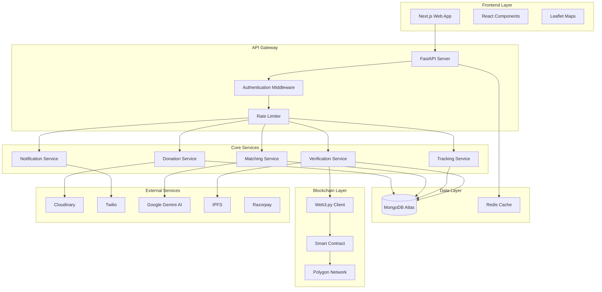
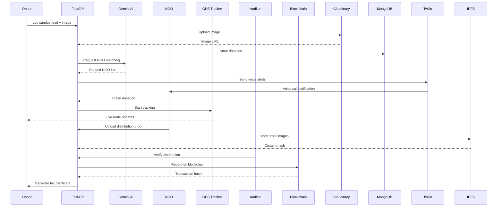
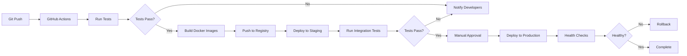

# Design Document: Aahar-Daata (Nourish-Net)

## Overview

Aahar-Daata is a full-stack blockchain-powered food redistribution platform built with a modern microservices architecture. The system consists of:

- **Frontend**: Next.js 16 with React 19 and TypeScript for server-side rendering and optimal performance
- **Backend API**: FastAPI (Python) providing RESTful endpoints for all platform operations
- **Database**: MongoDB Atlas for flexible document storage of donations, users, and transactions
- **Blockchain Layer**: Solidity smart contracts deployed on Polygon for cost-effective immutable records
- **AI Engine**: Google Gemini AI for intelligent matching and predictive analytics
- **External Services**: Cloudinary (image storage), Twilio (voice alerts), Razorpay (payments), IPFS (decentralized proof storage)

The platform follows a event-driven architecture where donation creation triggers a cascade of automated processes: AI matching, NGO notifications, GPS tracking, blockchain recording, and certificate generation.

## Architecture

### System Architecture Diagram



### Data Flow: Donation Lifecycle



## Components and Interfaces

### 1. Authentication Service

**Responsibilities:**
- User registration and login for donors, NGOs, and auditors
- JWT token generation and validation
- Role-based access control (RBAC)
- Password hashing and verification

**Interfaces:**

```typescript
interface AuthService {
  registerDonor(data: DonorRegistration): Promise<User>
  registerNGO(data: NGORegistration): Promise<User>
  login(credentials: LoginCredentials): Promise<AuthToken>
  validateToken(token: string): Promise<User>
  refreshToken(refreshToken: string): Promise<AuthToken>
}

interface DonorRegistration {
  name: string
  type: 'hotel' | 'restaurant' | 'individual'
  email: string
  phone: string
  password: string
  location: GeoCoordinates
  documents?: string[]
}

interface NGORegistration {
  name: string
  registrationNumber: string
  email: string
  phone: string
  password: string
  location: GeoCoordinates
  capacity: number
  foodTypesAccepted: string[]
  preferredLanguage: Language
  documents: string[]
}

interface LoginCredentials {
  email: string
  password: string
}

interface AuthToken {
  accessToken: string
  refreshToken: string
  expiresIn: number
  user: User
}
```

### 2. Donation Service

**Responsibilities:**
- Create and manage donation records
- Upload and store food images
- Track donation status lifecycle
- Generate unique donation IDs

**Interfaces:**

```typescript
interface DonationService {
  createDonation(data: DonationInput, donorId: string): Promise<Donation>
  getDonation(donationId: string): Promise<Donation>
  updateDonationStatus(donationId: string, status: DonationStatus): Promise<Donation>
  getDonationsByDonor(donorId: string, filters?: DonationFilters): Promise<Donation[]>
  getAvailableDonations(location: GeoCoordinates, radius: number): Promise<Donation[]>
}

interface DonationInput {
  foodType: string
  quantity: number
  unit: 'kg' | 'liters' | 'servings'
  expiryTime: Date
  dietaryTags: string[]
  image: File
  description?: string
}

interface Donation {
  id: string
  donorId: string
  foodType: string
  quantity: number
  unit: string
  expiryTime: Date
  dietaryTags: string[]
  imageUrl: string
  location: GeoCoordinates
  status: DonationStatus
  claimedBy?: string
  claimedAt?: Date
  distributedAt?: Date
  verifiedAt?: Date
  blockchainTxHash?: string
  createdAt: Date
  updatedAt: Date
}

type DonationStatus = 
  | 'available' 
  | 'claimed' 
  | 'picked_up' 
  | 'distributed' 
  | 'verified' 
  | 'rejected' 
  | 'expired'

interface GeoCoordinates {
  latitude: number
  longitude: number
}
```

### 3. AI Matching Service

**Responsibilities:**
- Match donations with suitable NGOs based on proximity, capacity, and preferences
- Rank NGOs by distance, trust score, and compatibility
- Predict donation patterns and demand forecasting
- Optimize matching algorithms over time

**Interfaces:**

```typescript
interface MatchingService {
  findSuitableNGOs(donation: Donation): Promise<NGOMatch[]>
  rankNGOs(ngos: NGO[], donation: Donation): Promise<NGOMatch[]>
  predictDonationPattern(donorId: string): Promise<PredictionResult>
  forecastDemand(region: GeoCoordinates, timeWindow: TimeWindow): Promise<DemandForecast>
}

interface NGOMatch {
  ngo: NGO
  distance: number
  compatibilityScore: number
  estimatedPickupTime: number
  rank: number
}

interface NGO {
  id: string
  name: string
  registrationNumber: string
  location: GeoCoordinates
  capacity: number
  currentLoad: number
  foodTypesAccepted: string[]
  trustScore: number
  phone: string
  preferredLanguage: Language
  isVerified: boolean
  isActive: boolean
}

interface PredictionResult {
  predictedQuantity: number
  predictedTime: Date
  confidence: number
  historicalPattern: DataPoint[]
}

interface DemandForecast {
  region: GeoCoordinates
  expectedDonations: number
  expectedDemand: number
  surplus: number
  timeWindow: TimeWindow
}

type Language = 'en' | 'hi' | 'ta' | 'te' | 'bn'
```

### 4. Notification Service

**Responsibilities:**
- Send voice alerts to NGOs via Twilio
- Send email notifications for certificates and updates
- Handle notification retries and fallbacks
- Log notification delivery status

**Interfaces:**

```typescript
interface NotificationService {
  sendVoiceAlert(ngo: NGO, donation: Donation): Promise<VoiceCallResult>
  sendEmailNotification(recipient: string, template: EmailTemplate, data: any): Promise<EmailResult>
  sendSMSNotification(phone: string, message: string): Promise<SMSResult>
  retryFailedNotifications(): Promise<void>
}

interface VoiceCallResult {
  callSid: string
  status: 'initiated' | 'ringing' | 'answered' | 'completed' | 'failed'
  duration?: number
  response?: 'accepted' | 'declined' | 'no_answer'
  timestamp: Date
}

interface EmailResult {
  messageId: string
  status: 'sent' | 'delivered' | 'failed'
  timestamp: Date
}

type EmailTemplate = 
  | 'donation_claimed' 
  | 'tax_certificate' 
  | 'verification_complete' 
  | 'account_verified'
```

### 5. GPS Tracking Service

**Responsibilities:**
- Record NGO location waypoints during pickup
- Calculate optimal routes
- Detect route deviations
- Verify geo-tagged distribution proofs

**Interfaces:**

```typescript
interface TrackingService {
  startTracking(donationId: string, ngoId: string): Promise<TrackingSession>
  recordWaypoint(sessionId: string, location: GeoCoordinates): Promise<void>
  getTrackingData(sessionId: string): Promise<TrackingData>
  verifyGeoTag(image: File, expectedLocation: GeoCoordinates, tolerance: number): Promise<boolean>
  calculateRoute(start: GeoCoordinates, end: GeoCoordinates): Promise<Route>
}

interface TrackingSession {
  id: string
  donationId: string
  ngoId: string
  startTime: Date
  endTime?: Date
  waypoints: Waypoint[]
  totalDistance: number
  status: 'active' | 'completed' | 'aborted'
}

interface Waypoint {
  location: GeoCoordinates
  timestamp: Date
  speed?: number
  accuracy?: number
}

interface TrackingData {
  session: TrackingSession
  currentLocation?: GeoCoordinates
  estimatedArrival?: Date
  deviations: RouteDeviation[]
}

interface Route {
  distance: number
  duration: number
  waypoints: GeoCoordinates[]
  instructions: string[]
}

interface RouteDeviation {
  location: GeoCoordinates
  timestamp: Date
  deviationDistance: number
  reason?: string
}
```

### 6. Verification Service

**Responsibilities:**
- Manage auditor review queue
- Validate distribution proofs
- Approve or reject distributions
- Maintain audit trail

**Interfaces:**

```typescript
interface VerificationService {
  getReviewQueue(auditorId: string): Promise<Donation[]>
  reviewDistribution(donationId: string, decision: ReviewDecision): Promise<VerificationResult>
  getAuditTrail(donationId: string): Promise<AuditEntry[]>
  flagSuspiciousActivity(donationId: string, reason: string): Promise<void>
}

interface ReviewDecision {
  auditorId: string
  approved: boolean
  comments?: string
  rejectionReason?: string
  timestamp: Date
}

interface VerificationResult {
  donationId: string
  status: 'verified' | 'rejected'
  auditorId: string
  timestamp: Date
  certificateGenerated: boolean
}

interface AuditEntry {
  id: string
  donationId: string
  action: string
  performedBy: string
  timestamp: Date
  metadata: Record<string, any>
}
```

### 7. Blockchain Service

**Responsibilities:**
- Interact with Polygon smart contracts
- Record verified donations on-chain
- Query blockchain records
- Handle transaction retries and gas optimization

**Interfaces:**

```typescript
interface BlockchainService {
  recordDonation(donation: VerifiedDonation): Promise<BlockchainRecord>
  getDonationRecord(txHash: string): Promise<BlockchainRecord>
  queryDonationsByDonor(donorAddress: string): Promise<BlockchainRecord[]>
  estimateGasCost(): Promise<GasEstimate>
}

interface VerifiedDonation {
  donationId: string
  donorId: string
  ngoId: string
  foodType: string
  quantity: number
  distributionTimestamp: Date
  ipfsProofHash: string
  auditorId: string
}

interface BlockchainRecord {
  transactionHash: string
  blockNumber: number
  donationId: string
  donorAddress: string
  ngoAddress: string
  quantity: number
  timestamp: Date
  ipfsHash: string
  gasUsed: number
}

interface GasEstimate {
  estimatedGas: number
  gasPrice: number
  totalCost: number
  currency: string
}
```

### 8. Gamification Service

**Responsibilities:**
- Award brownie points to donors
- Update NGO trust scores
- Maintain leaderboards
- Handle achievements and badges

**Interfaces:**

```typescript
interface GamificationService {
  awardPoints(userId: string, points: number, reason: string): Promise<UserScore>
  updateTrustScore(ngoId: string, delta: number, reason: string): Promise<TrustScore>
  getLeaderboard(type: 'donor' | 'ngo', limit: number): Promise<LeaderboardEntry[]>
  getUserAchievements(userId: string): Promise<Achievement[]>
}

interface UserScore {
  userId: string
  totalPoints: number
  rank: number
  level: number
  achievements: string[]
}

interface TrustScore {
  ngoId: string
  score: number
  successfulDistributions: number
  failedPickups: number
  lastUpdated: Date
}

interface LeaderboardEntry {
  rank: number
  userId: string
  name: string
  points: number
  level: number
  avatar?: string
}

interface Achievement {
  id: string
  name: string
  description: string
  icon: string
  unlockedAt: Date
  rarity: 'common' | 'rare' | 'epic' | 'legendary'
}
```

### 9. Certificate Service

**Responsibilities:**
- Generate PDF tax certificates
- Store certificate metadata
- Send certificates via email
- Handle certificate reprints

**Interfaces:**

```typescript
interface CertificateService {
  generateCertificate(donation: Donation, verification: VerificationResult): Promise<Certificate>
  getCertificate(certificateId: string): Promise<Certificate>
  sendCertificate(certificateId: string, email: string): Promise<EmailResult>
  getCertificatesByDonor(donorId: string): Promise<Certificate[]>
}

interface Certificate {
  id: string
  certificateNumber: string
  donationId: string
  donorId: string
  donorName: string
  foodType: string
  quantity: number
  verificationDate: Date
  auditorName: string
  auditorSignature: string
  blockchainTxHash: string
  pdfUrl: string
  generatedAt: Date
}
```

### 10. Analytics Service

**Responsibilities:**
- Aggregate platform statistics
- Generate impact reports
- Provide time-series data
- Create geographic heat maps

**Interfaces:**

```typescript
interface AnalyticsService {
  getPlatformStats(): Promise<PlatformStats>
  getDonationTimeSeries(timeRange: TimeRange): Promise<TimeSeriesData>
  getGeographicHeatMap(region?: BoundingBox): Promise<HeatMapData>
  generateImpactReport(timeRange: TimeRange): Promise<ImpactReport>
}

interface PlatformStats {
  totalMeals: number
  activeDonors: number
  verifiedNGOs: number
  successRate: number
  wasteReduction: number
  co2Saved: number
  lastUpdated: Date
}

interface TimeSeriesData {
  dataPoints: DataPoint[]
  metric: string
  timeRange: TimeRange
}

interface DataPoint {
  timestamp: Date
  value: number
}

interface HeatMapData {
  region: BoundingBox
  density: DensityPoint[]
  maxDensity: number
}

interface DensityPoint {
  location: GeoCoordinates
  intensity: number
  donationCount: number
}

interface ImpactReport {
  timeRange: TimeRange
  totalDonations: number
  totalMeals: number
  topDonors: LeaderboardEntry[]
  topNGOs: LeaderboardEntry[]
  wasteReduction: number
  sdgAlignment: SDGMetrics
}

interface SDGMetrics {
  sdg2_zeroHunger: number
  sdg12_responsibleConsumption: number
  sdg13_climateAction: number
  sdg17_partnerships: number
}

interface TimeRange {
  start: Date
  end: Date
}

interface BoundingBox {
  northEast: GeoCoordinates
  southWest: GeoCoordinates
}

interface TimeWindow {
  start: Date
  end: Date
  duration: number
}
```

## Data Models

### MongoDB Collections

#### Users Collection

```typescript
interface UserDocument {
  _id: ObjectId
  email: string
  passwordHash: string
  role: 'donor' | 'ngo' | 'auditor'
  profile: DonorProfile | NGOProfile | AuditorProfile
  isVerified: boolean
  isActive: boolean
  createdAt: Date
  updatedAt: Date
}

interface DonorProfile {
  name: string
  type: 'hotel' | 'restaurant' | 'individual'
  phone: string
  location: GeoCoordinates
  address: string
  documents: string[]
  browniePoints: number
  totalDonations: number
  verifiedDonations: number
}

interface NGOProfile {
  name: string
  registrationNumber: string
  phone: string
  location: GeoCoordinates
  address: string
  capacity: number
  currentLoad: number
  foodTypesAccepted: string[]
  trustScore: number
  preferredLanguage: Language
  documents: string[]
  totalClaims: number
  successfulDistributions: number
  failedPickups: number
}

interface AuditorProfile {
  name: string
  employeeId: string
  department: string
  phone: string
  region: string
  totalVerifications: number
}
```

#### Donations Collection

```typescript
interface DonationDocument {
  _id: ObjectId
  donorId: ObjectId
  foodType: string
  quantity: number
  unit: string
  expiryTime: Date
  dietaryTags: string[]
  imageUrl: string
  imageCloudinaryId: string
  location: GeoCoordinates
  address: string
  status: DonationStatus
  claimedBy?: ObjectId
  claimedAt?: Date
  matchedNGOs: ObjectId[]
  notificationsSent: NotificationLog[]
  trackingSessionId?: ObjectId
  distributionProof?: DistributionProof
  verificationResult?: VerificationResult
  blockchainTxHash?: string
  certificateId?: ObjectId
  createdAt: Date
  updatedAt: Date
}

interface NotificationLog {
  ngoId: ObjectId
  method: 'voice' | 'sms' | 'email'
  status: string
  sentAt: Date
  response?: string
}

interface DistributionProof {
  images: string[]
  ipfsHashes: string[]
  geoTags: GeoCoordinates[]
  uploadedAt: Date
  beneficiaryCount?: number
  notes?: string
}
```

#### Tracking Sessions Collection

```typescript
interface TrackingSessionDocument {
  _id: ObjectId
  donationId: ObjectId
  ngoId: ObjectId
  startTime: Date
  endTime?: Date
  waypoints: Waypoint[]
  totalDistance: number
  averageSpeed: number
  deviations: RouteDeviation[]
  status: 'active' | 'completed' | 'aborted'
  createdAt: Date
  updatedAt: Date
}
```

#### Certificates Collection

```typescript
interface CertificateDocument {
  _id: ObjectId
  certificateNumber: string
  donationId: ObjectId
  donorId: ObjectId
  donorName: string
  foodType: string
  quantity: number
  verificationDate: Date
  auditorId: ObjectId
  auditorName: string
  auditorSignature: string
  blockchainTxHash: string
  pdfUrl: string
  pdfCloudinaryId: string
  emailSent: boolean
  emailSentAt?: Date
  generatedAt: Date
}
```

#### Audit Trail Collection

```typescript
interface AuditTrailDocument {
  _id: ObjectId
  donationId: ObjectId
  action: string
  performedBy: ObjectId
  performedByRole: string
  timestamp: Date
  metadata: Record<string, any>
  ipAddress?: string
  userAgent?: string
}
```

### Solidity Smart Contract

```solidity
// SPDX-License-Identifier: MIT
pragma solidity ^0.8.0;

contract AaharDaataRegistry {
    struct DonationRecord {
        string donationId;
        address donorAddress;
        address ngoAddress;
        string foodType;
        uint256 quantity;
        uint256 distributionTimestamp;
        string ipfsProofHash;
        address auditorAddress;
        uint256 recordedAt;
    }
    
    mapping(string => DonationRecord) public donations;
    mapping(address => string[]) public donorDonations;
    mapping(address => string[]) public ngoDonations;
    
    event DonationRecorded(
        string indexed donationId,
        address indexed donorAddress,
        address indexed ngoAddress,
        uint256 quantity,
        uint256 timestamp
    );
    
    function recordDonation(
        string memory donationId,
        address donorAddress,
        address ngoAddress,
        string memory foodType,
        uint256 quantity,
        uint256 distributionTimestamp,
        string memory ipfsProofHash,
        address auditorAddress
    ) public {
        require(bytes(donations[donationId].donationId).length == 0, "Donation already recorded");
        
        DonationRecord memory record = DonationRecord({
            donationId: donationId,
            donorAddress: donorAddress,
            ngoAddress: ngoAddress,
            foodType: foodType,
            quantity: quantity,
            distributionTimestamp: distributionTimestamp,
            ipfsProofHash: ipfsProofHash,
            auditorAddress: auditorAddress,
            recordedAt: block.timestamp
        });
        
        donations[donationId] = record;
        donorDonations[donorAddress].push(donationId);
        ngoDonations[ngoAddress].push(donationId);
        
        emit DonationRecorded(donationId, donorAddress, ngoAddress, quantity, block.timestamp);
    }
    
    function getDonation(string memory donationId) public view returns (DonationRecord memory) {
        return donations[donationId];
    }
    
    function getDonorDonations(address donorAddress) public view returns (string[] memory) {
        return donorDonations[donorAddress];
    }
    
    function getNGODonations(address ngoAddress) public view returns (string[] memory) {
        return ngoDonations[ngoAddress];
    }
}
```

## API Specifications

### REST API Endpoints

#### Authentication Endpoints

```
POST /api/v1/auth/register/donor
POST /api/v1/auth/register/ngo
POST /api/v1/auth/login
POST /api/v1/auth/refresh
POST /api/v1/auth/logout
GET  /api/v1/auth/me
```

#### Donation Endpoints

```
POST   /api/v1/donations
GET    /api/v1/donations/:id
GET    /api/v1/donations
PATCH  /api/v1/donations/:id/status
POST   /api/v1/donations/:id/claim
POST   /api/v1/donations/:id/distribution-proof
GET    /api/v1/donations/available
```

#### NGO Endpoints

```
GET    /api/v1/ngos
GET    /api/v1/ngos/:id
PATCH  /api/v1/ngos/:id
GET    /api/v1/ngos/:id/claims
POST   /api/v1/ngos/:id/emergency-request
```

#### Tracking Endpoints

```
POST   /api/v1/tracking/start
POST   /api/v1/tracking/:sessionId/waypoint
GET    /api/v1/tracking/:sessionId
GET    /api/v1/tracking/donation/:donationId
```

#### Verification Endpoints

```
GET    /api/v1/verification/queue
POST   /api/v1/verification/:donationId/review
GET    /api/v1/verification/:donationId/audit-trail
```

#### Certificate Endpoints

```
GET    /api/v1/certificates/:id
GET    /api/v1/certificates/donor/:donorId
POST   /api/v1/certificates/:id/resend
```

#### Analytics Endpoints

```
GET    /api/v1/analytics/stats
GET    /api/v1/analytics/timeseries
GET    /api/v1/analytics/heatmap
GET    /api/v1/analytics/impact-report
```

#### Gamification Endpoints

```
GET    /api/v1/leaderboard/donors
GET    /api/v1/leaderboard/ngos
GET    /api/v1/users/:id/score
GET    /api/v1/users/:id/achievements
```

### API Request/Response Examples

#### Create Donation

**Request:**
```http
POST /api/v1/donations
Authorization: Bearer <token>
Content-Type: multipart/form-data

{
  "foodType": "Biryani",
  "quantity": 50,
  "unit": "servings",
  "expiryTime": "2024-01-15T20:00:00Z",
  "dietaryTags": ["non-vegetarian", "halal"],
  "description": "Leftover from wedding event",
  "image": <file>
}
```

**Response:**
```json
{
  "success": true,
  "data": {
    "id": "don_abc123xyz",
    "donorId": "usr_donor001",
    "foodType": "Biryani",
    "quantity": 50,
    "unit": "servings",
    "expiryTime": "2024-01-15T20:00:00Z",
    "dietaryTags": ["non-vegetarian", "halal"],
    "imageUrl": "https://res.cloudinary.com/aahar/image/upload/v1234/donations/abc123.jpg",
    "location": {
      "latitude": 12.9716,
      "longitude": 77.5946
    },
    "status": "available",
    "matchedNGOs": ["ngo_001", "ngo_002", "ngo_003"],
    "createdAt": "2024-01-15T14:30:00Z"
  },
  "message": "Donation created successfully. 3 NGOs have been notified."
}
```

#### Claim Donation

**Request:**
```http
POST /api/v1/donations/don_abc123xyz/claim
Authorization: Bearer <ngo_token>
```

**Response:**
```json
{
  "success": true,
  "data": {
    "donationId": "don_abc123xyz",
    "claimedBy": "ngo_001",
    "claimedAt": "2024-01-15T14:35:00Z",
    "status": "claimed",
    "donorContact": "+91-9876543210",
    "pickupAddress": "123 MG Road, Bangalore",
    "estimatedDistance": 2.3,
    "trackingSessionId": "trk_session001"
  },
  "message": "Donation claimed successfully. GPS tracking has started."
}
```


## Correctness Properties

*A property is a characteristic or behavior that should hold true across all valid executions of a system—essentially, a formal statement about what the system should do. Properties serve as the bridge between human-readable specifications and machine-verifiable correctness guarantees.*

### Authentication and Registration Properties

**Property 1: Valid registration creates account**
*For any* valid donor or NGO registration data (complete required fields, valid formats), submitting the registration should result in a new user account being created with the correct role and profile data.
**Validates: Requirements 1.1, 12.1**

**Property 2: Invalid registration is rejected**
*For any* registration data with missing required fields, invalid formats, or constraint violations, the system should reject the registration and return specific validation error messages identifying the issues.
**Validates: Requirements 1.2**

**Property 3: Authentication round-trip**
*For any* successfully registered user, logging in with their correct credentials should authenticate them and grant access, while logging in with incorrect credentials should always be rejected.
**Validates: Requirements 1.3, 1.4**

**Property 4: Location data persistence**
*For any* donor or NGO registration with location coordinates, retrieving the user profile should return the same location coordinates that were provided during registration.
**Validates: Requirements 1.5, 12.5**

### Donation Management Properties

**Property 5: Valid donation creation**
*For any* valid donation data (food type, quantity, future expiry time, image), creating a donation should result in a new donation record with status "available", a unique ID, stored image URL, and the donor's GPS coordinates.
**Validates: Requirements 2.1, 2.2, 2.3, 2.5, 2.6**

**Property 6: Invalid donation rejection**
*For any* donation data with missing required fields, past expiry time, or invalid values, the system should reject the donation and return validation errors.
**Validates: Requirements 2.4**

**Property 7: Donation ID uniqueness**
*For any* set of created donations, all donation IDs should be unique with no duplicates.
**Validates: Requirements 2.5**

### AI Matching Properties

**Property 8: Geographic proximity matching**
*For any* donation and set of NGOs, the AI matcher should only return NGOs within the specified radius (initially 4km, expanding to 10km if needed), and all returned NGOs should be verified and active.
**Validates: Requirements 3.1, 3.5**

**Property 9: NGO ranking correctness**
*For any* set of matched NGOs, they should be ranked in order where closer distance, higher trust score, and available capacity result in higher ranking positions.
**Validates: Requirements 3.2**

**Property 10: Capacity filtering**
*For any* NGO whose current load equals or exceeds their capacity, that NGO should never appear in matching results.
**Validates: Requirements 3.3**

**Property 11: Food type compatibility**
*For any* donation with a specific food type, only NGOs that accept that food type should be included in the matching results.
**Validates: Requirements 3.4**

**Property 12: Match result size limit**
*For any* donation matching request, the returned list of matched NGOs should contain at most 5 NGOs.
**Validates: Requirements 3.6**

### Notification and Claiming Properties

**Property 13: Matching triggers notifications**
*For any* donation that is successfully matched with NGOs, voice alerts should be sent to all matched NGOs' phone numbers.
**Validates: Requirements 4.1, 13.1**

**Property 14: Notification content completeness**
*For any* notification sent to an NGO, it should contain all required donation details: food type, quantity, expiry time, donor location, and distance.
**Validates: Requirements 4.2**

**Property 15: Claim updates status**
*For any* available donation, when an NGO successfully claims it, the donation status should change to "claimed", the claimedBy field should be set to that NGO's ID, and a tracking session should be initiated.
**Validates: Requirements 4.3, 5.1**

**Property 16: Double-claim prevention**
*For any* donation that has been claimed by an NGO, subsequent claim attempts by other NGOs should be rejected with an error.
**Validates: Requirements 4.4, 4.6**

**Property 17: Voice call language matching**
*For any* voice alert sent to an NGO, the message should be in the NGO's preferred language as specified in their profile.
**Validates: Requirements 13.2, 16.3**

**Property 18: Call logging completeness**
*For any* voice call attempt, the system should create a log entry with timestamp, NGO ID, call status, and outcome.
**Validates: Requirements 13.5**

### GPS Tracking Properties

**Property 19: Tracking data persistence**
*For any* active tracking session, all recorded waypoints with timestamps should be stored and retrievable for audit purposes.
**Validates: Requirements 5.5**

**Property 20: Proximity detection**
*For any* tracking session where the NGO's location comes within 50 meters of the donor location, a pickup confirmation notification should be sent to the donor.
**Validates: Requirements 5.3**

**Property 21: Route deviation detection**
*For any* tracking session where the NGO deviates significantly from the optimal route (>500 meters), a route deviation alert should be generated.
**Validates: Requirements 5.4**

### Distribution Proof Properties

**Property 22: Geo-tag extraction**
*For any* image uploaded as distribution proof that contains GPS metadata in EXIF data, the system should extract and store the coordinates and timestamp.
**Validates: Requirements 6.1**

**Property 23: Geo-tag validation**
*For any* image uploaded as distribution proof that lacks GPS metadata, the system should reject the upload and return an error requesting geo-tagged images.
**Validates: Requirements 6.2**

**Property 24: Distribution proof updates status**
*For any* claimed donation, when valid distribution proof is uploaded, the donation status should change to "distributed" and the proof should be stored on IPFS with the content hash recorded.
**Validates: Requirements 6.3, 6.5**

**Property 25: Late distribution flagging**
*For any* distribution that occurs more than 6 hours after the pickup time, the donation should be flagged for auditor review.
**Validates: Requirements 6.4**

### Verification and Audit Properties

**Property 26: Review queue population**
*For any* donation that reaches "distributed" status, it should appear in the auditor's review queue.
**Validates: Requirements 7.1**

**Property 27: Verification metadata completeness**
*For any* donation in the review queue, retrieving its details should return all metadata including donor info, NGO info, GPS trail, distribution proof, and all timestamps.
**Validates: Requirements 7.2**

**Property 28: Approval workflow**
*For any* donation that an auditor approves, the status should change to "verified", a blockchain transaction should be initiated, and tax certificate generation should be triggered.
**Validates: Requirements 7.3, 8.1, 9.1**

**Property 29: Rejection workflow**
*For any* donation that an auditor rejects, the status should change to "rejected" and a notification with rejection reasons should be sent to the NGO.
**Validates: Requirements 7.4**

**Property 30: Audit trail immutability**
*For any* auditor action (approval, rejection, flagging), an audit entry should be created with timestamp and metadata, and once created, audit entries should never be modified or deleted.
**Validates: Requirements 7.5**

### Blockchain Properties

**Property 31: Blockchain record completeness**
*For any* verified donation recorded on blockchain, the transaction should include donor ID, NGO ID, food quantity, distribution timestamp, and IPFS proof hash.
**Validates: Requirements 8.2**

**Property 32: Transaction hash storage**
*For any* confirmed blockchain transaction, the transaction hash should be stored with the donation record and be retrievable.
**Validates: Requirements 8.3**

**Property 33: Blockchain retry logic**
*For any* failed blockchain transaction, the system should retry up to 3 times with exponential backoff before marking as permanently failed.
**Validates: Requirements 8.4**

**Property 34: Blockchain event emission**
*For any* successful blockchain transaction, the smart contract should emit a DonationRecorded event that can be queried.
**Validates: Requirements 8.5**

### Certificate Properties

**Property 35: Certificate content completeness**
*For any* generated tax certificate, it should contain donor details, donation details, verification date, auditor signature, blockchain transaction hash, and a unique certificate number.
**Validates: Requirements 9.2, 9.4**

**Property 36: Certificate delivery**
*For any* generated certificate, it should be sent to the donor via email and be downloadable from the donor dashboard.
**Validates: Requirements 9.3**

**Property 37: Certificate uniqueness**
*For any* set of generated certificates, all certificate numbers should be unique.
**Validates: Requirements 9.4**

**Property 38: Certificate reprint consistency**
*For any* certificate, requesting a reprint should return the exact same certificate (same PDF, same certificate number) as the original.
**Validates: Requirements 9.5**

### Gamification Properties

**Property 39: Brownie points calculation**
*For any* verified donation, the donor should be awarded brownie points equal to the number of meal equivalents (quantity converted to meals).
**Validates: Requirements 10.1**

**Property 40: Trust score increase**
*For any* NGO that successfully completes a distribution (verified status), their trust score should increase by 1 point, capped at maximum 100.
**Validates: Requirements 10.2**

**Property 41: Trust score decrease**
*For any* NGO that claims a donation but fails to pick it up, their trust score should decrease by 5 points.
**Validates: Requirements 10.3**

**Property 42: Trust score suspension threshold**
*For any* NGO whose trust score falls below 50, their account should be automatically suspended and marked for review.
**Validates: Requirements 10.4**

**Property 43: Leaderboard accuracy**
*For any* leaderboard request (donor or NGO), the returned top 10 should be correctly sorted by points/scores in descending order and reflect current values.
**Validates: Requirements 10.5, 10.6**

### Analytics and Dashboard Properties

**Property 44: Statistics calculation accuracy**
*For any* dashboard statistics request, the returned values (total meals, active donors, verified NGOs, success rate) should accurately reflect the current state of the database.
**Validates: Requirements 11.1**

**Property 45: Time-series data correctness**
*For any* time range, the analytics time-series data should include all donations and distributions within that range, correctly aggregated by time period.
**Validates: Requirements 11.3**

**Property 46: Heat map density calculation**
*For any* geographic region, the heat map density values should accurately represent the number of donations in each area.
**Validates: Requirements 11.4**

**Property 47: Blockchain audit trail searchability**
*For any* search query on blockchain records, the results should include all matching transactions with their hashes and timestamps.
**Validates: Requirements 11.5**

### Payment Properties

**Property 48: Payment recording**
*For any* successful payment transaction, the system should record the transaction with amount, timestamp, and award brownie points at the rate of 1 point per ₹10.
**Validates: Requirements 14.2**

**Property 49: Payment receipt generation**
*For any* successful payment, a receipt should be generated and sent via email to the donor.
**Validates: Requirements 14.4**

**Property 50: Payment history completeness**
*For any* user, their payment history should include all past transactions with dates and amounts in chronological order.
**Validates: Requirements 14.5**

### Security Properties

**Property 51: Password encryption**
*For any* user account, the stored password should be a bcrypt hash with at least 12 rounds, never stored in plaintext.
**Validates: Requirements 15.1**

**Property 52: Sensitive data encryption**
*For any* sensitive data fields (phone numbers, addresses), the stored values should be encrypted at rest.
**Validates: Requirements 15.3**

**Property 53: Role-based access control**
*For any* user attempting to access a resource, access should only be granted if their role has the required permissions for that resource.
**Validates: Requirements 15.4**

**Property 54: Data anonymization**
*For any* user requesting data deletion, their personal data should be anonymized (replaced with generic values) while preserving blockchain records and aggregate statistics.
**Validates: Requirements 15.5**

**Property 55: Access logging**
*For any* data access operation, an access log entry should be created with user ID, resource accessed, timestamp, and action performed.
**Validates: Requirements 15.6**

### Internationalization Properties

**Property 56: Language support completeness**
*For any* supported language (English, Hindi, Tamil, Telugu, Bengali), all UI text keys should have translations available.
**Validates: Requirements 16.1, 16.4**

**Property 57: Language preference persistence**
*For any* user who selects a language preference, that preference should be stored and all subsequent UI text should be displayed in that language.
**Validates: Requirements 16.2**

### Offline Capability Properties

**Property 58: Offline action queuing**
*For any* action (claim, upload) performed while offline, the action should be queued locally and executed when connectivity is restored.
**Validates: Requirements 17.1, 17.2**

**Property 59: Sync conflict resolution**
*For any* queued action that conflicts with server state (e.g., donation already claimed), the system should detect the conflict, notify the user, and resolve it appropriately.
**Validates: Requirements 17.3**

### Predictive Analytics Properties

**Property 60: Prediction bounds**
*For any* donation prediction, the predicted quantity and time should be within reasonable bounds based on historical data (e.g., within 2 standard deviations of historical mean).
**Validates: Requirements 18.1**

**Property 61: Preference-based prioritization**
*For any* NGO that has claimed a specific food type more than 5 times, donations of that food type should rank that NGO higher in matching results.
**Validates: Requirements 18.2**

### Emergency Request Properties

**Property 62: Emergency broadcast radius**
*For any* emergency request submitted by an NGO, all donors within 10km should receive the broadcast notification.
**Validates: Requirements 19.1**

**Property 63: Emergency priority matching**
*For any* donation created in response to an emergency request, it should be matched with the requesting NGO first, bypassing normal ranking.
**Validates: Requirements 19.2**

**Property 64: Emergency request rate limiting**
*For any* NGO, they should not be able to submit more than 3 emergency requests within a 30-day period.
**Validates: Requirements 19.4**

### API Properties

**Property 65: API authentication requirement**
*For any* API request to protected endpoints without a valid API key, the system should return a 401 Unauthorized error.
**Validates: Requirements 20.2, 20.5**

**Property 66: API rate limiting**
*For any* API key, requests should be limited to 100 per minute, and exceeding this limit should result in 429 Too Many Requests errors.
**Validates: Requirements 20.3**

## Error Handling

### Error Categories

1. **Validation Errors (400 Bad Request)**
   - Missing required fields
   - Invalid data formats
   - Constraint violations (e.g., past expiry time)
   - Out-of-range values

2. **Authentication Errors (401 Unauthorized)**
   - Invalid credentials
   - Expired tokens
   - Missing authentication headers
   - Invalid API keys

3. **Authorization Errors (403 Forbidden)**
   - Insufficient permissions for resource
   - Role-based access violations
   - Suspended account access attempts

4. **Resource Errors (404 Not Found)**
   - Donation not found
   - User not found
   - Certificate not found

5. **Conflict Errors (409 Conflict)**
   - Donation already claimed
   - Duplicate registration
   - Concurrent modification conflicts

6. **Rate Limiting Errors (429 Too Many Requests)**
   - API rate limit exceeded
   - Emergency request limit exceeded

7. **External Service Errors (502 Bad Gateway, 503 Service Unavailable)**
   - Cloudinary upload failures
   - Twilio call failures
   - Blockchain transaction failures
   - IPFS upload failures
   - Razorpay payment gateway errors

8. **Internal Errors (500 Internal Server Error)**
   - Database connection failures
   - Unexpected exceptions
   - Data corruption

### Error Response Format

All API errors follow a consistent format:

```typescript
interface ErrorResponse {
  success: false
  error: {
    code: string
    message: string
    details?: any
    timestamp: string
    requestId: string
  }
}
```

### Error Handling Strategies

**Retry Logic:**
- Blockchain transactions: 3 retries with exponential backoff (1s, 2s, 4s)
- External API calls: 2 retries with 1-second delay
- Voice calls: 3 attempts per NGO before moving to next

**Fallback Mechanisms:**
- If Cloudinary fails, store images temporarily in MongoDB GridFS
- If voice calls fail, send SMS as fallback
- If blockchain recording fails after retries, queue for manual review
- If IPFS upload fails, store proof images on Cloudinary as backup

**Circuit Breaker:**
- Implement circuit breaker for external services
- Open circuit after 5 consecutive failures
- Half-open state after 30 seconds
- Close circuit after 2 successful requests

**Graceful Degradation:**
- If AI matching service is unavailable, use simple distance-based matching
- If analytics service is slow, return cached statistics
- If blockchain is congested, queue transactions for later processing

## Testing Strategy

### Dual Testing Approach

The Aahar-Daata platform requires both unit testing and property-based testing for comprehensive coverage:

**Unit Tests:**
- Specific examples demonstrating correct behavior
- Edge cases (empty inputs, boundary values, special characters)
- Error conditions and exception handling
- Integration points between components
- Mock external services (Twilio, Cloudinary, Blockchain)

**Property-Based Tests:**
- Universal properties that hold for all inputs
- Comprehensive input coverage through randomization
- Minimum 100 iterations per property test
- Each test tagged with: **Feature: aahar-daata, Property {number}: {property_text}**

### Property-Based Testing Framework

**For Python (Backend):**
- Use **Hypothesis** library for property-based testing
- Configure: `@given(st.data())` with `@settings(max_examples=100)`
- Generate random test data: users, donations, NGOs, locations

**For TypeScript (Frontend):**
- Use **fast-check** library for property-based testing
- Configure: `fc.assert(fc.property(...), { numRuns: 100 })`
- Generate random UI states and user interactions

### Test Coverage Requirements

- Minimum 80% code coverage for all services
- 100% coverage for critical paths (authentication, donation lifecycle, blockchain recording)
- All 66 correctness properties must have corresponding property-based tests
- All error handling paths must have unit tests

### Testing Environments

1. **Local Development:**
   - MongoDB local instance
   - Mock external services
   - Local blockchain (Ganache)

2. **CI/CD Pipeline:**
   - MongoDB Atlas test cluster
   - Staging external services
   - Polygon Mumbai testnet

3. **Staging:**
   - Production-like environment
   - Real external services (test accounts)
   - Polygon Mumbai testnet

4. **Production:**
   - MongoDB Atlas production cluster
   - Production external services
   - Polygon mainnet

### Test Data Generation

**For Property-Based Tests:**

```python
# Example: Generate random donations
from hypothesis import given, strategies as st

@given(
    food_type=st.text(min_size=1, max_size=50),
    quantity=st.integers(min_value=1, max_value=1000),
    expiry_hours=st.integers(min_value=1, max_value=48)
)
def test_donation_creation_property(food_type, quantity, expiry_hours):
    """Property 5: Valid donation creation"""
    # Test that valid donations are created correctly
    pass
```

```typescript
// Example: Generate random NGO matches
import fc from 'fast-check';

fc.assert(
  fc.property(
    fc.array(ngoArbitrary, { minLength: 1, maxLength: 10 }),
    fc.record({ latitude: fc.double(), longitude: fc.double() }),
    (ngos, donorLocation) => {
      // Property 8: Geographic proximity matching
      const matches = matchNGOs(ngos, donorLocation);
      return matches.every(ngo => 
        calculateDistance(ngo.location, donorLocation) <= 10000
      );
    }
  ),
  { numRuns: 100 }
);
```

### Integration Testing

**Critical Integration Points:**
1. Frontend ↔ Backend API
2. Backend ↔ MongoDB
3. Backend ↔ Blockchain (Web3.py ↔ Smart Contract)
4. Backend ↔ External Services (Twilio, Cloudinary, IPFS, Razorpay)
5. AI Matching Service ↔ Google Gemini API

**Integration Test Scenarios:**
- Complete donation lifecycle (creation → matching → claiming → distribution → verification → blockchain → certificate)
- Payment flow (initiation → Razorpay → callback → recording → receipt)
- Offline sync (queue actions → restore connectivity → sync → conflict resolution)
- Emergency request flow (NGO request → donor broadcast → response → priority matching)

### Performance Testing

**Load Testing:**
- Simulate 1000 concurrent users
- Test donation creation rate: 100 donations/minute
- Test matching performance: <2 seconds per donation
- Test API response times: <500ms for 95th percentile

**Stress Testing:**
- Test system behavior under extreme load
- Identify breaking points
- Verify graceful degradation

**Blockchain Performance:**
- Test gas optimization
- Measure transaction confirmation times
- Test batch processing for high volume

### Security Testing

**Penetration Testing:**
- SQL injection attempts (MongoDB NoSQL injection)
- XSS attacks on frontend
- CSRF protection verification
- Authentication bypass attempts
- Authorization escalation attempts

**Security Audits:**
- Smart contract audit by third-party
- Code review for security vulnerabilities
- Dependency vulnerability scanning
- OWASP Top 10 compliance check

### Monitoring and Observability

**Metrics to Track:**
- API response times (p50, p95, p99)
- Error rates by endpoint
- Donation lifecycle completion rate
- Blockchain transaction success rate
- External service availability
- Database query performance

**Logging:**
- Structured logging (JSON format)
- Log levels: DEBUG, INFO, WARNING, ERROR, CRITICAL
- Correlation IDs for request tracing
- Sensitive data masking in logs

**Alerting:**
- High error rate (>5% of requests)
- Slow response times (>2s average)
- External service failures
- Blockchain transaction failures
- Database connection issues
- Low trust score patterns (potential fraud)

## Deployment Architecture

### Infrastructure

**Frontend Deployment:**
- Vercel for Next.js hosting
- CDN for static assets
- Edge functions for SSR

**Backend Deployment:**
- AWS ECS or Google Cloud Run for FastAPI containers
- Auto-scaling based on CPU/memory
- Load balancer for traffic distribution

**Database:**
- MongoDB Atlas (M10 cluster minimum)
- Replica set for high availability
- Automated backups (daily)

**Blockchain:**
- Polygon mainnet for production
- Infura or Alchemy as RPC provider
- Multi-signature wallet for contract ownership

**Caching:**
- Redis for session storage and caching
- Cache frequently accessed data (leaderboards, statistics)

### CI/CD Pipeline



### Environment Variables

**Required Environment Variables:**

```bash
# Database
MONGODB_URI=mongodb+srv://...
REDIS_URL=redis://...

# Blockchain
WEB3_PROVIDER_URL=https://polygon-mainnet.infura.io/v3/...
SMART_CONTRACT_ADDRESS=0x...
PRIVATE_KEY=0x...

# External Services
CLOUDINARY_CLOUD_NAME=...
CLOUDINARY_API_KEY=...
CLOUDINARY_API_SECRET=...
TWILIO_ACCOUNT_SID=...
TWILIO_AUTH_TOKEN=...
TWILIO_PHONE_NUMBER=...
RAZORPAY_KEY_ID=...
RAZORPAY_KEY_SECRET=...
GEMINI_API_KEY=...
IPFS_API_URL=...

# Security
JWT_SECRET=...
JWT_EXPIRY=3600
BCRYPT_ROUNDS=12
API_RATE_LIMIT=100

# Application
FRONTEND_URL=https://aahar-daata.com
BACKEND_URL=https://api.aahar-daata.com
ENVIRONMENT=production
LOG_LEVEL=INFO
```

### Disaster Recovery

**Backup Strategy:**
- MongoDB: Daily automated backups, 30-day retention
- Certificates: Stored in Cloudinary with backup to S3
- Blockchain: Immutable, no backup needed
- Code: Git repository with multiple remotes

**Recovery Procedures:**
- Database restore: <1 hour RTO
- Application redeployment: <30 minutes
- DNS failover: <5 minutes

**High Availability:**
- Multi-region deployment for critical services
- Database replica sets across availability zones
- Load balancer health checks with automatic failover

## Future Enhancements

1. **Mobile Applications:**
   - Native iOS and Android apps
   - Push notifications for real-time alerts
   - Offline-first architecture

2. **Advanced AI Features:**
   - Computer vision for food quality assessment
   - Predictive demand forecasting with ML models
   - Automated fraud detection

3. **Expanded Blockchain Features:**
   - NFT badges for top contributors
   - Tokenized rewards system
   - Cross-chain compatibility

4. **Social Features:**
   - Donor and NGO profiles with impact stories
   - Social sharing of impact metrics
   - Community forums

5. **Government Integration:**
   - Direct integration with tax filing systems
   - Real-time reporting to food safety authorities
   - Compliance automation

6. **International Expansion:**
   - Multi-currency support
   - Region-specific regulations
   - Additional language support

## Conclusion

The Aahar-Daata platform represents a comprehensive solution to food waste and hunger, combining modern web technologies, blockchain transparency, AI-powered matching, and real-time tracking. The architecture is designed for scalability, reliability, and security, with extensive testing strategies to ensure correctness. The 66 correctness properties provide a formal specification of system behavior that can be verified through property-based testing, ensuring the platform operates correctly across all scenarios.


## Enhanced Features Design

### Corporate CSR Dashboard

**Architecture:**
- Dedicated CSR service with white-label capabilities
- Report generation engine using Puppeteer for PDF creation
- Social media card generator with dynamic branding
- Embeddable widget API with CORS support

**Data Model:**

```typescript
interface CorporateProfile extends DonorProfile {
  companyName: string
  industry: string
  csrContactPerson: string
  brandingAssets: {
    logo: string
    primaryColor: string
    secondaryColor: string
  }
  csrGoals: {
    targetMeals: number
    targetPeriod: string
    sdgFocus: string[]
  }
  impactReports: ObjectId[]
}

interface ImpactReport {
  id: string
  corporateId: ObjectId
  period: { start: Date; end: Date }
  metrics: {
    totalDonations: number
    totalMeals: number
    co2Saved: number
    beneficiariesReached: number
    sdgAlignment: SDGMetrics
  }
  socialMediaCards: string[]
  pdfUrl: string
  generatedAt: Date
}
```

### Volunteer Coordination System

**Architecture:**
- Volunteer management service with task assignment
- Real-time location tracking for volunteers
- Rating and review system for volunteer performance
- Availability scheduling with calendar integration

**Data Model:**

```typescript
interface Volunteer {
  id: string
  ngoId: ObjectId
  name: string
  phone: string
  email: string
  location: GeoCoordinates
  availability: AvailabilitySchedule
  skills: string[]
  vehicleType?: 'bike' | 'car' | 'van'
  rating: number
  completedTasks: number
  volunteerPoints: number
  badges: string[]
}

interface VolunteerTask {
  id: string
  donationId: ObjectId
  volunteerId: ObjectId
  type: 'pickup' | 'distribution' | 'both'
  status: 'assigned' | 'accepted' | 'in_progress' | 'completed' | 'cancelled'
  assignedAt: Date
  acceptedAt?: Date
  completedAt?: Date
  rating?: number
  feedback?: string
}
```

### Smart Expiry Management

**Architecture:**
- ML-based pattern recognition for recurring donations
- Time-series forecasting for optimal donation timing
- Escalating alert system with configurable thresholds
- Dynamic matching priority adjustment

**Algorithm:**

```python
def calculate_optimal_donation_time(donor_id: str) -> datetime:
    """
    Analyze historical donation patterns to recommend optimal timing
    """
    historical_donations = get_donor_donations(donor_id, days=90)
    
    # Extract temporal features
    claim_times = [d.claimed_at - d.created_at for d in historical_donations if d.claimed_at]
    avg_claim_time = mean(claim_times)
    
    # Identify peak NGO activity hours
    peak_hours = identify_peak_claim_hours(donor_id)
    
    # Calculate optimal time (expiry - avg_claim_time - buffer)
    buffer = timedelta(hours=1)
    optimal_time = expiry_time - avg_claim_time - buffer
    
    # Adjust to peak hours if possible
    if optimal_time.hour not in peak_hours:
        optimal_time = adjust_to_peak_hour(optimal_time, peak_hours)
    
    return optimal_time
```

### Quality Assurance System

**Architecture:**
- Multi-stakeholder feedback collection (NGOs, beneficiaries)
- Quality score calculation with weighted factors
- Automated improvement suggestions using AI
- Reputation system with badges and certifications

**Data Model:**

```typescript
interface QualityRating {
  id: string
  donationId: ObjectId
  ratedBy: ObjectId
  raterType: 'ngo' | 'beneficiary'
  ratings: {
    freshness: number  // 1-5
    packaging: number  // 1-5
    quantityAccuracy: number  // 1-5
    overall: number  // 1-5
  }
  comments?: string
  photos?: string[]
  timestamp: Date
}

interface DonorQualityProfile {
  donorId: ObjectId
  averageRating: number
  totalRatings: number
  ratingDistribution: { [key: number]: number }
  badges: QualityBadge[]
  improvementSuggestions: string[]
  lastUpdated: Date
}

type QualityBadge = 
  | 'trusted_donor' 
  | 'quality_champion' 
  | 'consistent_excellence' 
  | 'five_star_donor'
```

### Automated Compliance Reporting

**Architecture:**
- Scheduled report generation (daily, weekly, monthly)
- Multi-format export engine (CSV, PDF, XML, JSON)
- Regulatory template library for different authorities
- Automated submission to government portals via API

**Report Templates:**

```typescript
interface ComplianceReport {
  id: string
  reportType: 'fssai' | 'tax_authority' | 'environmental' | 'custom'
  period: { start: Date; end: Date }
  data: {
    totalDonations: number
    totalWeight: number
    foodCategories: { [category: string]: number }
    distributionLocations: GeoCoordinates[]
    verifiedTransactions: number
    complianceScore: number
  }
  generatedAt: Date
  submittedAt?: Date
  submissionStatus?: 'pending' | 'submitted' | 'acknowledged' | 'rejected'
  exportFormats: {
    pdf: string
    csv: string
    xml: string
  }
}
```

### Blockchain NFT Recognition System

**Smart Contract Extension:**

```solidity
// SPDX-License-Identifier: MIT
pragma solidity ^0.8.0;

import "@openzeppelin/contracts/token/ERC721/ERC721.sol";
import "@openzeppelin/contracts/utils/Counters.sol";

contract AaharDaataAchievementNFT is ERC721 {
    using Counters for Counters.Counter;
    Counters.Counter private _tokenIds;
    
    struct Achievement {
        string achievementType;  // "100_donations", "1000_meals", "1_year"
        uint256 totalDonations;
        uint256 totalMeals;
        uint256 co2Saved;
        uint256 achievedAt;
        string metadataURI;
    }
    
    mapping(uint256 => Achievement) public achievements;
    mapping(address => uint256[]) public userAchievements;
    
    event AchievementMinted(
        uint256 indexed tokenId,
        address indexed recipient,
        string achievementType,
        uint256 timestamp
    );
    
    constructor() ERC721("AaharDaata Achievement", "AAHA") {}
    
    function mintAchievement(
        address recipient,
        string memory achievementType,
        uint256 totalDonations,
        uint256 totalMeals,
        uint256 co2Saved,
        string memory metadataURI
    ) public returns (uint256) {
        _tokenIds.increment();
        uint256 newTokenId = _tokenIds.current();
        
        _mint(recipient, newTokenId);
        
        achievements[newTokenId] = Achievement({
            achievementType: achievementType,
            totalDonations: totalDonations,
            totalMeals: totalMeals,
            co2Saved: co2Saved,
            achievedAt: block.timestamp,
            metadataURI: metadataURI
        });
        
        userAchievements[recipient].push(newTokenId);
        
        emit AchievementMinted(newTokenId, recipient, achievementType, block.timestamp);
        
        return newTokenId;
    }
    
    function getAchievement(uint256 tokenId) public view returns (Achievement memory) {
        require(_exists(tokenId), "Achievement does not exist");
        return achievements[tokenId];
    }
    
    function getUserAchievements(address user) public view returns (uint256[] memory) {
        return userAchievements[user];
    }
}
```

### AI-Powered Fraud Detection

**Architecture:**
- Real-time anomaly detection using ML models
- Behavioral pattern analysis with time-series data
- Image forensics for distribution proof validation
- Risk scoring system with automated actions

**Fraud Detection Algorithm:**

```python
class FraudDetectionEngine:
    def __init__(self):
        self.anomaly_detector = IsolationForest(contamination=0.1)
        self.image_hasher = ImageHash()
        self.risk_thresholds = {
            'low': 30,
            'medium': 60,
            'high': 80
        }
    
    def calculate_risk_score(self, user_id: str, donation_id: str) -> int:
        """
        Calculate fraud risk score (0-100) based on multiple factors
        """
        score = 0
        
        # Pattern analysis
        pattern_score = self.analyze_donation_patterns(user_id)
        score += pattern_score * 0.3
        
        # GPS anomalies
        gps_score = self.detect_gps_anomalies(donation_id)
        score += gps_score * 0.25
        
        # Image authenticity
        image_score = self.verify_image_authenticity(donation_id)
        score += image_score * 0.25
        
        # Behavioral signals
        behavior_score = self.analyze_user_behavior(user_id)
        score += behavior_score * 0.2
        
        return min(int(score), 100)
    
    def analyze_donation_patterns(self, user_id: str) -> float:
        """
        Detect suspicious patterns in donation history
        """
        donations = get_user_donations(user_id, days=90)
        
        # Check for same donor-NGO pairs
        pair_frequency = Counter([(d.donor_id, d.ngo_id) for d in donations])
        max_frequency = max(pair_frequency.values()) if pair_frequency else 0
        
        # Check for unusual timing patterns
        time_variance = calculate_time_variance(donations)
        
        # Check for quantity anomalies
        quantity_outliers = detect_outliers([d.quantity for d in donations])
        
        # Combine signals
        pattern_risk = (
            (max_frequency / len(donations)) * 40 +
            (1 - time_variance) * 30 +
            len(quantity_outliers) * 30
        )
        
        return min(pattern_risk, 100)
    
    def detect_gps_anomalies(self, donation_id: str) -> float:
        """
        Detect impossible GPS patterns (teleportation, no movement, etc.)
        """
        tracking_data = get_tracking_data(donation_id)
        waypoints = tracking_data.waypoints
        
        anomalies = 0
        
        for i in range(1, len(waypoints)):
            prev = waypoints[i-1]
            curr = waypoints[i]
            
            # Calculate speed
            distance = haversine_distance(prev.location, curr.location)
            time_diff = (curr.timestamp - prev.timestamp).total_seconds()
            speed = distance / time_diff if time_diff > 0 else 0
            
            # Check for impossible speeds (>120 km/h)
            if speed > 33.33:  # 120 km/h in m/s
                anomalies += 1
            
            # Check for no movement when should be moving
            if distance < 10 and time_diff > 300:  # <10m in 5 minutes
                anomalies += 0.5
        
        return min((anomalies / len(waypoints)) * 100, 100)
    
    def verify_image_authenticity(self, donation_id: str) -> float:
        """
        Detect duplicate or manipulated images
        """
        donation = get_donation(donation_id)
        image_hash = self.image_hasher.hash(donation.imageUrl)
        
        # Check for duplicates in database
        similar_images = find_similar_images(image_hash, threshold=5)
        
        if len(similar_images) > 0:
            return 100  # Duplicate image detected
        
        # Check for manipulation using ELA (Error Level Analysis)
        manipulation_score = detect_image_manipulation(donation.imageUrl)
        
        return manipulation_score
```

### WhatsApp Business Integration

**Architecture:**
- WhatsApp Business API integration
- Natural language processing for command parsing
- Media handling for photo uploads
- Session management for conversational flows

**Message Handlers:**

```typescript
interface WhatsAppService {
  sendMessage(phone: string, message: string, buttons?: Button[]): Promise<void>
  sendMediaMessage(phone: string, mediaUrl: string, caption: string): Promise<void>
  handleIncomingMessage(message: WhatsAppMessage): Promise<void>
  handleButtonResponse(response: ButtonResponse): Promise<void>
}

interface WhatsAppMessage {
  from: string
  text: string
  media?: {
    type: 'image' | 'video' | 'document'
    url: string
  }
  timestamp: Date
}

class WhatsAppMessageHandler {
  async handleIncomingMessage(message: WhatsAppMessage): Promise<void> {
    const user = await getUserByPhone(message.from)
    
    if (!user) {
      await this.sendWelcomeMessage(message.from)
      return
    }
    
    const intent = await this.parseIntent(message.text)
    
    switch (intent.action) {
      case 'CLAIM':
        await this.handleClaimAction(user, intent.params)
        break
      case 'STATUS':
        await this.handleStatusQuery(user)
        break
      case 'LOG_DONATION':
        await this.handleDonationLogging(user, message)
        break
      case 'HELP':
        await this.sendHelpMessage(user)
        break
      default:
        await this.sendUnknownCommandMessage(user)
    }
  }
  
  async parseIntent(text: string): Promise<Intent> {
    // Use NLP to parse user intent
    const normalizedText = text.toLowerCase().trim()
    
    if (normalizedText.includes('claim') || normalizedText === 'yes') {
      return { action: 'CLAIM', params: {} }
    }
    
    if (normalizedText.includes('status') || normalizedText.includes('points')) {
      return { action: 'STATUS', params: {} }
    }
    
    if (normalizedText.includes('donate') || normalizedText.includes('log')) {
      return { action: 'LOG_DONATION', params: {} }
    }
    
    return { action: 'UNKNOWN', params: {} }
  }
}
```

### Carbon Footprint Tracking

**Calculation Engine:**

```typescript
interface CarbonCalculator {
  calculateCO2Saved(foodType: string, quantity: number, unit: string): number
  getEquivalentMetrics(co2Kg: number): EquivalentMetrics
}

class CarbonCalculationService implements CarbonCalculator {
  // CO2 emission factors (kg CO2 per kg food wasted)
  private emissionFactors: { [foodType: string]: number } = {
    'rice': 2.7,
    'wheat': 1.4,
    'vegetables': 0.5,
    'fruits': 0.4,
    'dairy': 3.2,
    'meat': 27.0,
    'poultry': 6.9,
    'fish': 5.1,
    'bread': 1.2,
    'default': 2.0
  }
  
  calculateCO2Saved(foodType: string, quantity: number, unit: string): number {
    // Convert to kg
    const quantityKg = this.convertToKg(quantity, unit)
    
    // Get emission factor
    const factor = this.emissionFactors[foodType.toLowerCase()] || this.emissionFactors['default']
    
    // Calculate CO2 saved
    const co2Saved = quantityKg * factor
    
    return co2Saved
  }
  
  getEquivalentMetrics(co2Kg: number): EquivalentMetrics {
    return {
      treesPlanted: co2Kg / 21,  // 1 tree absorbs ~21kg CO2/year
      carMilesAvoided: co2Kg / 0.404,  // 1 mile = 0.404kg CO2
      homeEnergyDays: co2Kg / 28.9,  // Average home = 28.9kg CO2/day
      phoneCharges: co2Kg / 0.008  // 1 phone charge = 0.008kg CO2
    }
  }
  
  private convertToKg(quantity: number, unit: string): number {
    const conversions: { [unit: string]: number } = {
      'kg': 1,
      'g': 0.001,
      'liters': 1,  // Approximate for liquids
      'servings': 0.3  // Average serving = 300g
    }
    
    return quantity * (conversions[unit] || 1)
  }
}
```

### Enhanced Correctness Properties for New Features

**Property 67: CSR report generation**
*For any* corporate donor with completed donations, generating a CSR report should include all required metrics (meals, CO2, SDG alignment) and be delivered in the requested format.
**Validates: Requirements 21.2, 21.3**

**Property 68: Volunteer task assignment**
*For any* donation claimed by an NGO, assigning a volunteer should create a task record, send notifications, and initiate location tracking when accepted.
**Validates: Requirements 22.1, 22.2, 22.3**

**Property 69: Expiry alert escalation**
*For any* donation approaching expiry, alerts should be sent at configured intervals (2h, 1h, 30m) to all matched NGOs with increasing urgency.
**Validates: Requirements 23.2**

**Property 70: Quality rating impact**
*For any* donor receiving quality ratings, their average rating should be calculated correctly and quality badges should be awarded when thresholds are met (>4.5 = Trusted Donor).
**Validates: Requirements 24.1, 24.5**

**Property 71: Compliance report completeness**
*For any* compliance report generation request, the report should include all donations within the specified period with accurate aggregations and be exportable in all required formats.
**Validates: Requirements 25.1, 25.5**

**Property 72: NFT minting on milestones**
*For any* donor reaching achievement milestones (100 donations, 1000 meals), an NFT should be minted with correct metadata and transferred to the donor's wallet.
**Validates: Requirements 27.1, 27.2**

**Property 73: Fraud risk scoring**
*For any* user activity, the fraud detection system should calculate a risk score (0-100) based on patterns, GPS data, and image analysis, and trigger appropriate actions when thresholds are exceeded.
**Validates: Requirements 28.1, 28.2, 28.3, 28.4**

**Property 74: Delivery partner integration**
*For any* donation claimed by an NGO without pickup capability, arranging delivery should create a delivery task, track the partner's location, and collect proof of delivery.
**Validates: Requirements 29.1, 29.2, 29.3, 29.4**

**Property 75: Campaign progress tracking**
*For any* active campaign, the system should accurately track progress toward goals and update leaderboards in real-time with bonus points applied correctly.
**Validates: Requirements 30.2, 30.3**

**Property 76: WhatsApp command processing**
*For any* WhatsApp message received, the system should parse the intent correctly and execute the corresponding action (claim, status, log donation) with appropriate responses.
**Validates: Requirements 31.2, 31.3, 31.4**

**Property 77: Carbon footprint calculation**
*For any* verified donation, the CO2 saved should be calculated using food-type-specific emission factors and displayed with equivalent metrics (trees, car miles).
**Validates: Requirements 32.1, 32.2, 32.4**

**Property 78: Smart contract governance**
*For any* proposed smart contract upgrade, the system should enforce voting period, require multi-signature approval, and maintain complete version history.
**Validates: Requirements 33.2, 33.3, 33.4**

**Property 79: Impact story curation**
*For any* donor viewing their dashboard, impact stories should be displayed from their donations with proper anonymization and consent verification.
**Validates: Requirements 34.1, 34.2, 34.3**

**Property 80: Predictive health monitoring**
*For any* system metric trending negatively, proactive alerts should be sent to administrators before SLA breaches occur, and auto-scaling should activate during predicted peak times.
**Validates: Requirements 35.1, 35.2**

## Advanced Testing Strategies

### Chaos Engineering

Implement chaos engineering practices to test system resilience:

**Chaos Experiments:**
1. **Network Partitions**: Simulate network failures between services
2. **Latency Injection**: Add random delays to external service calls
3. **Resource Exhaustion**: Test behavior under CPU/memory pressure
4. **Dependency Failures**: Simulate Twilio, Cloudinary, Blockchain outages
5. **Data Corruption**: Test recovery from corrupted database records

**Chaos Testing Framework:**

```python
class ChaosExperiment:
    def __init__(self, name: str, target: str, failure_mode: str):
        self.name = name
        self.target = target
        self.failure_mode = failure_mode
    
    def run(self, duration: int):
        """
        Run chaos experiment for specified duration
        """
        logger.info(f"Starting chaos experiment: {self.name}")
        
        # Inject failure
        self.inject_failure()
        
        # Monitor system behavior
        metrics = self.monitor_system(duration)
        
        # Restore normal operation
        self.restore_system()
        
        # Analyze results
        return self.analyze_results(metrics)
    
    def inject_failure(self):
        if self.failure_mode == 'network_partition':
            self.block_network_traffic(self.target)
        elif self.failure_mode == 'latency':
            self.add_latency(self.target, delay_ms=5000)
        elif self.failure_mode == 'service_crash':
            self.kill_service(self.target)
    
    def monitor_system(self, duration: int) -> Dict:
        """
        Monitor key metrics during chaos
        """
        metrics = {
            'error_rate': [],
            'response_time': [],
            'throughput': [],
            'availability': []
        }
        
        for _ in range(duration):
            metrics['error_rate'].append(get_error_rate())
            metrics['response_time'].append(get_avg_response_time())
            metrics['throughput'].append(get_requests_per_second())
            metrics['availability'].append(check_service_availability())
            time.sleep(1)
        
        return metrics
```

### A/B Testing Framework

Implement A/B testing for feature optimization:

```typescript
interface ABTest {
  id: string
  name: string
  variants: Variant[]
  targetMetric: string
  startDate: Date
  endDate: Date
  status: 'draft' | 'running' | 'completed' | 'cancelled'
}

interface Variant {
  id: string
  name: string
  description: string
  trafficPercentage: number
  config: Record<string, any>
}

class ABTestingService {
  async assignVariant(userId: string, testId: string): Promise<Variant> {
    // Consistent hashing for stable variant assignment
    const hash = this.hashUserId(userId, testId)
    const test = await this.getTest(testId)
    
    let cumulative = 0
    for (const variant of test.variants) {
      cumulative += variant.trafficPercentage
      if (hash < cumulative) {
        await this.trackAssignment(userId, testId, variant.id)
        return variant
      }
    }
    
    return test.variants[0]  // Default variant
  }
  
  async trackMetric(userId: string, testId: string, metricValue: number): Promise<void> {
    const assignment = await this.getAssignment(userId, testId)
    await this.recordMetric(testId, assignment.variantId, metricValue)
  }
  
  async analyzeResults(testId: string): Promise<ABTestResults> {
    const test = await this.getTest(testId)
    const results: ABTestResults = {
      testId,
      variants: []
    }
    
    for (const variant of test.variants) {
      const metrics = await this.getVariantMetrics(testId, variant.id)
      results.variants.push({
        variantId: variant.id,
        sampleSize: metrics.length,
        mean: this.calculateMean(metrics),
        stdDev: this.calculateStdDev(metrics),
        confidenceInterval: this.calculateCI(metrics)
      })
    }
    
    // Perform statistical significance test
    results.isSignificant = this.performTTest(results.variants)
    results.winner = this.determineWinner(results.variants)
    
    return results
  }
}
```

## Scalability Considerations

### Horizontal Scaling Strategy

**Service-Level Scaling:**
- **API Gateway**: Auto-scale based on request rate (target: 70% CPU)
- **Matching Service**: Scale based on queue depth (target: <100 pending matches)
- **Notification Service**: Scale based on message queue size
- **Tracking Service**: Scale based on active tracking sessions

**Database Scaling:**
- **MongoDB Sharding**: Shard by geographic region (India North, South, East, West)
- **Read Replicas**: 3 read replicas for analytics queries
- **Caching Strategy**: Redis cluster with 3 nodes, cache hit ratio target: >80%

**Blockchain Scaling:**
- **Transaction Batching**: Batch up to 100 donations per blockchain transaction
- **Layer 2 Solutions**: Consider Polygon zkEVM for higher throughput
- **Gas Optimization**: Use EIP-1559 for dynamic gas pricing

### Performance Targets

**API Response Times:**
- P50: <200ms
- P95: <500ms
- P99: <1000ms

**Throughput:**
- Donations: 1000/minute
- Claims: 500/minute
- Tracking updates: 10,000/minute

**Database Performance:**
- Query latency: <50ms (P95)
- Write latency: <100ms (P95)
- Connection pool: 100 connections per instance

## Security Hardening

### Additional Security Measures

**1. API Security:**
- Rate limiting per IP and per user
- Request signing for sensitive operations
- Input sanitization and validation
- SQL/NoSQL injection prevention
- XSS protection with Content Security Policy

**2. Blockchain Security:**
- Multi-signature wallet for contract ownership
- Time-locked upgrades (24-hour delay)
- Emergency pause functionality
- Reentrancy guards on all state-changing functions
- Regular security audits by third parties

**3. Data Security:**
- Encryption at rest (AES-256)
- Encryption in transit (TLS 1.3)
- Key rotation every 90 days
- Secrets management with HashiCorp Vault
- Regular penetration testing

**4. Authentication Security:**
- Multi-factor authentication for high-value accounts
- Biometric authentication for mobile apps
- Session timeout after 30 minutes of inactivity
- Device fingerprinting for fraud detection
- Account lockout after 5 failed login attempts

## Conclusion

The enhanced Aahar-Daata platform incorporates enterprise-grade features including corporate CSR dashboards, volunteer coordination, AI-powered fraud detection, blockchain NFT recognition, WhatsApp integration, and comprehensive carbon footprint tracking. With 80 correctness properties, advanced testing strategies including chaos engineering and A/B testing, and robust scalability and security measures, the platform is positioned to become the leading food redistribution solution in India and potentially expand globally. The combination of social impact, technological innovation, and business sustainability creates a compelling value proposition for all stakeholders.
